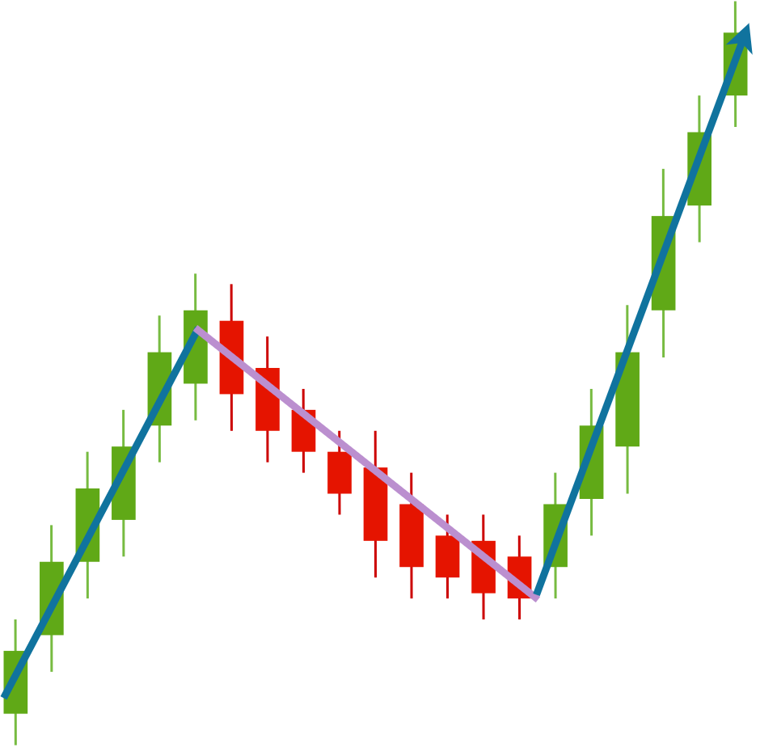

<a name="readme-top"></a>

<!-- PROJECT SHIELDS -->
[![Forks][forks-shield]][forks-url]
[![Stargazers][stars-shield]][stars-url]
[![Issues][issues-shield]][issues-url]
[![MIT License][license-shield]][license-url]
[![LinkedIn][linkedin-shield]][linkedin-url]


<!-- PROJECT LOGO -->
<br />
<div align="center">
  <a href="https://github.com/FowwazM/Stock-Price-Predictor">
    
  </a>

<h3 align="center">Stock Price Predictor</h3>

  <p align="center">
    A deep learning model to predict stock prices
    <br />
    <a href="https://github.com/FowwazM/Stock-Price-Predictor"><strong>Explore the docs »</strong></a>
    <br />
    <br />
    <a href="https://github.com/FowwazM/Stock-Price-Predictor/issues">Report Bug</a>
    ·
    <a href="https://github.com/FowwazM/Stock-Price-Predictor/issues">Request Feature</a>
  </p>
</div>


<!-- TABLE OF CONTENTS -->
<details>
  <summary>Table of Contents</summary>
  <ol>
    <li>
      <a href="#about-the-project">About The Project</a>
      <ul>
        <li><a href="#built-with">Built With</a></li>
      </ul>
    </li>
    <li>
      <a href="#getting-started">Getting Started</a>
      <ul>
        <li><a href="#prerequisites">Prerequisites</a></li>
        <li><a href="#installation">Installation</a></li>
      </ul>
    </li>
    <li><a href="#roadmap">Roadmap</a></li>
    <li><a href="#contributing">Contributing</a></li>
    <li><a href="#license">License</a></li>
    <li><a href="#contact">Contact</a></li>
    <li><a href="#acknowledgments">Acknowledgments</a></li>
  </ol>
</details>


<!-- ABOUT THE PROJECT -->
## About The Project

[![Product Name Screen Shot][product-screenshot]](https://github.com/FowwazM/Stock-Price-Predictor/)

This is a stock price predictor built in Python using Tensorflow. I have used deep learning, specifically a recurrent neural network in LSTM-gated cells, for this model. The model is trained on a dataset of S&P 500 stock prices every day since 2010 (link in <a href="#acknowledgments">acknowledgments</a>) and achieved an accuracy of 95.85% in my tests. You have to input the stock you want to predict prices for when running the program, and a graph with the prices since 2010 will be shown (split into training data, test data, and model predictions).

<p align="right">(<a href="#readme-top">back to top</a>)</p>


### Built With

* [![Tensorflow][Tensorflow-Badge]][Tensorflow-url]
* [![Keras][Keras-Badge]][Keras-url]
* [![Matplotlib][Matplotlib-Badge]][Matplotlib-url]
* [![NumPy][Numpy-Badge]][Numpy-url]
* [![Pandas][Pandas-Badge]][Pandas-url]
* [![scikit-learn][scikit-Badge]][scikit-url]

<p align="right">(<a href="#readme-top">back to top</a>)</p>


<!-- GETTING STARTED -->
## Getting Started

To get a local copy up and running follow these simple steps.

### Prerequisites

Ensure you have Python installed on your system from the [official site](https://www.python.org/downloads/).

Install the required libraries to your system:
* Tensorflow
  ```sh
  pip install tensorflow==2.16.1
  ```
* Matplotlib
  ```sh
  pip install matplotlib==3.8.3
  ```
* NumPy
  ```sh
  pip install numpy==1.26.4
  ```
* Pandas
  ```sh
  pip install pandas==2.2.1
  ```
* scikit-learn
  ```sh
  pip install scikit-learn==1.4.1.post1
  ```

### Installation

1. Clone the repo
   ```sh
   git clone https://github.com/FowwazM/Stock-Price-Predictor.git
   ```
2. Navigate to the Code folder
   ```sh
   ../Space-Invader/Code/
   ```
3. Run the eda_plots.py file to see the Exploratory Data Analysis plots
   ```sh
   python ./Space-Invader/Code/eda_plots.py
   ```
4. Run the results.py file to train a model and see its performance and graphed results
   ```sh
   python ./Space-Invader/Code/results.py
   ```

<p align="right">(<a href="#readme-top">back to top</a>)</p>


<!-- ROADMAP -->
## Roadmap

- [ ] Future Price Prediction
- [ ] Multiple Stock Predictions
- [ ] Link Program to a Web Interface

See the [open issues](https://github.com/FowwazM/Stock-Price-Predictor/issues) for a full list of proposed features (and known issues).

<p align="right">(<a href="#readme-top">back to top</a>)</p>


<!-- CONTRIBUTING -->
## Contributing

Contributions are what make the open source community such an amazing place to learn, inspire, and create. Any contributions you make are **greatly appreciated**.

If you have a suggestion that would make this better, please fork the repo and create a pull request. You can also simply open an issue with the tag "enhancement".
Don't forget to give the project a star! Thanks again!

1. Fork the Project
2. Create your Feature Branch (`git checkout -b feature/AmazingFeature`)
3. Commit your Changes (`git commit -m 'Add some AmazingFeature'`)
4. Push to the Branch (`git push origin feature/AmazingFeature`)
5. Open a Pull Request

<p align="right">(<a href="#readme-top">back to top</a>)</p>


<!-- LICENSE -->
## License

Distributed under the MIT License. See `LICENSE.txt` for more information.

<p align="right">(<a href="#readme-top">back to top</a>)</p>


<!-- CONTACT -->
## Contact

Fowwaz Moeen - [LinkedIn][linkedin-url] - fowwazmoeen@gmail.com

Project Link: [https://github.com/FowwazM/Stock-Price-Predictor](https://github.com/FowwazM/Stock-Price-Predictor)

<p align="right">(<a href="#readme-top">back to top</a>)</p>


<!-- ACKNOWLEDGMENTS -->
## Acknowledgments

* [Stocks Data](https://www.kaggle.com/datasets/andrewmvd/sp-500-stocks/discussion)
* [Markdown Badges](https://github.com/Ileriayo/markdown-badges?tab=readme-ov-file#markdown-badges)

<p align="right">(<a href="#readme-top">back to top</a>)</p>


<!-- MARKDOWN LINKS & IMAGES -->
<!-- https://www.markdownguide.org/basic-syntax/#reference-style-links -->
[contributors-shield]: https://img.shields.io/github/contributors/FowwazM/Stock-Price-Predictor.svg?style=for-the-badge
[contributors-url]: https://github.com/FowwazM/Stock-Price-Predictor/graphs/contributors
[forks-shield]: https://img.shields.io/github/forks/FowwazM/Stock-Price-Predictor.svg?style=for-the-badge
[forks-url]: https://github.com/FowwazM/Stock-Price-Predictor/network/members
[stars-shield]: https://img.shields.io/github/stars/FowwazM/Stock-Price-Predictor.svg?style=for-the-badge
[stars-url]: https://github.com/FowwazM/Stock-Price-Predictor/stargazers
[issues-shield]: https://img.shields.io/github/issues/FowwazM/Stock-Price-Predictor.svg?style=for-the-badge
[issues-url]: https://github.com/FowwazM/Stock-Price-Predictor/issues
[license-shield]: https://img.shields.io/github/license/FowwazM/Stock-Price-Predictor.svg?label=license&style=for-the-badge
[license-url]: https://github.com/FowwazM/Stock-Price-Predictor/blob/master/LICENSE.txt
[linkedin-shield]: https://img.shields.io/badge/-LinkedIn-black.svg?style=for-the-badge&logo=linkedin&colorB=555
[linkedin-url]: https://linkedin.com/in/fowwaz-moeen/
[product-screenshot]: Docs/screenshot.png
[Tensorflow-Badge]: https://img.shields.io/badge/TensorFlow-%23FF6F00.svg?style=for-the-badge&logo=TensorFlow&logoColor=white
[Tensorflow-url]: https://www.tensorflow.org/
[Keras-Badge]: https://img.shields.io/badge/Keras-%23D00000.svg?style=for-the-badge&logo=Keras&logoColor=white
[Keras-url]: https://keras.io/
[Matplotlib-Badge]: https://img.shields.io/badge/Matplotlib-%23ffffff.svg?style=for-the-badge&logo=Matplotlib&logoColor=black
[Matplotlib-url]: https://matplotlib.org/n
[Numpy-Badge]: https://img.shields.io/badge/numpy-%23013243.svg?style=for-the-badge&logo=numpy&logoColor=white
[Numpy-url]: https://numpy.org/
[Pandas-Badge]: https://img.shields.io/badge/pandas-%23150458.svg?style=for-the-badge&logo=pandas&logoColor=white
[Pandas-url]: https://pandas.pydata.org/
[scikit-Badge]: https://img.shields.io/badge/scikit--learn-%23F7931E.svg?style=for-the-badge&logo=scikit-learn&logoColor=white
[scikit-url]: https://scikit-learn.org/stable/